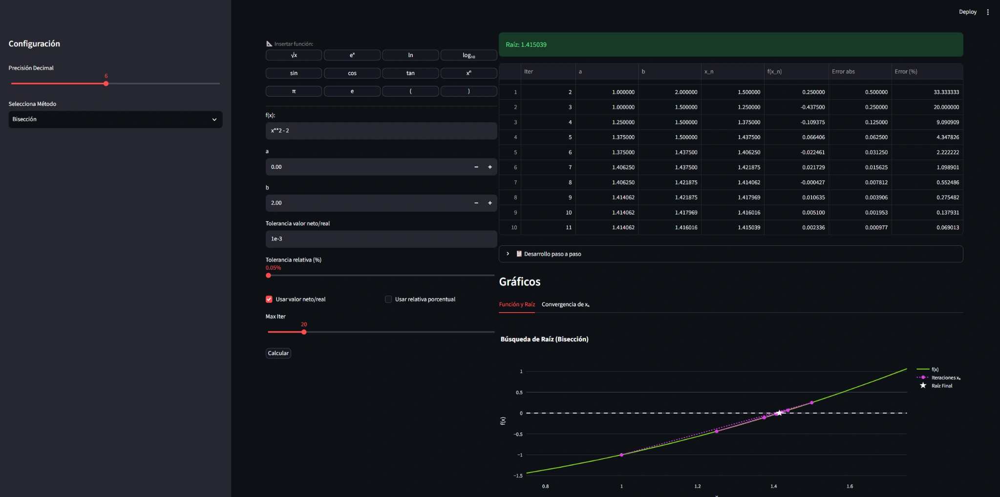
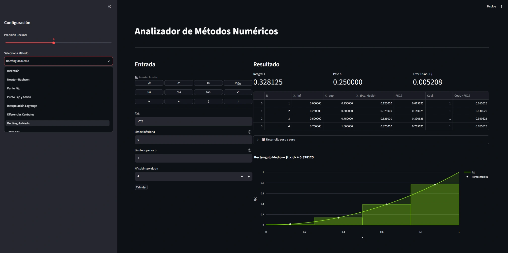
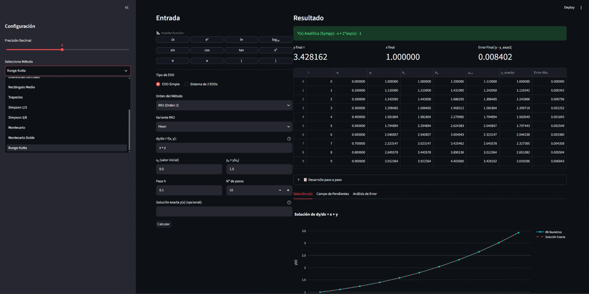

# Numerical Methods Solver

Interactive Python application developed collaboratively to explore numerical methods through calculations, visualizations, convergence analysis, and step-by-step results.

Built with Streamlit, the application covers root finding, interpolation, numerical integration, Monte Carlo techniques, and ordinary differential equations.

## Screenshots

These screenshots illustrate three types of numerical analysis: root finding by bisection, integration with the midpoint rule, and solving a differential equation with the second-order Runge-Kutta method (Heun). The method selectors are expanded in some views to show the available options. Click an image to view it at full resolution.

<table>
  <tr>
    <th colspan="2">Root Finding — Bisection</th>
  </tr>
  <tr>
    <td colspan="2" align="center">
      <a href="docs/screenshots/bisection.webp"></a>
    </td>
  </tr>
  <tr>
    <th>Numerical Integration — Midpoint Rule</th>
    <th>Differential Equations — Runge-Kutta (Heun)</th>
  </tr>
  <tr>
    <td align="center">
      <a href="docs/screenshots/midpoint-integration.webp"></a>
    </td>
    <td align="center">
      <a href="docs/screenshots/runge-kutta-heun.webp"></a>
    </td>
  </tr>
</table>

## Methods

The application includes:

- **Root finding:** bisection, Newton-Raphson, fixed-point iteration, and Aitken acceleration.
- **Interpolation and differentiation:** Lagrange interpolation and central differences.
- **Numerical integration:** midpoint and trapezoidal rules, Simpson's 1/3 and 3/8 rules.
- **Monte Carlo:** single and double Monte Carlo integration.
- **Differential equations:** Euler and Runge-Kutta methods.

## Features

- Interactive mathematical-function input and numerical-method selection.
- Configurable numerical parameters, precision, tolerances, and iteration limits.
- Iteration tables, intermediate calculations, and step-by-step explanations.
- Approximation errors and convergence analysis.
- Interactive function, integration, and differential-equation visualizations.
- Symbolic mathematical support with SymPy.

## Tech Stack

- Python
- Streamlit
- NumPy
- Pandas
- SciPy
- SymPy
- Plotly

## Running Locally

Create a virtual environment, install dependencies, and start the Streamlit application from the repository root.

**Windows PowerShell:**

```powershell
py -m venv .venv
.\.venv\Scripts\python.exe -m pip install -r requirements.txt
.\.venv\Scripts\python.exe -m streamlit run app.py
```

**macOS / Linux:**

```bash
python3 -m venv .venv
.venv/bin/python -m pip install -r requirements.txt
.venv/bin/python -m streamlit run app.py
```

Streamlit displays the local URL in the terminal (typically `http://localhost:8501`). Stop the application with `Ctrl+C`.

## Scope

This project is an educational and analytical tool for exploring numerical methods and understanding their behavior through interactive examples. It was developed collaboratively as part of an academic course.
